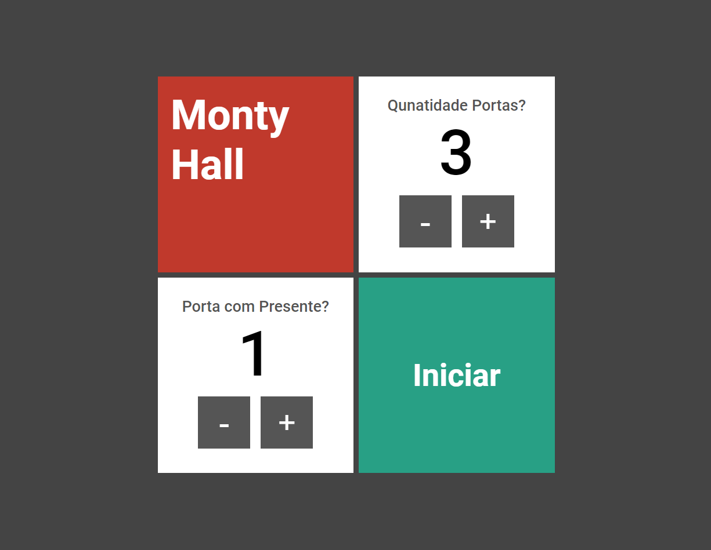
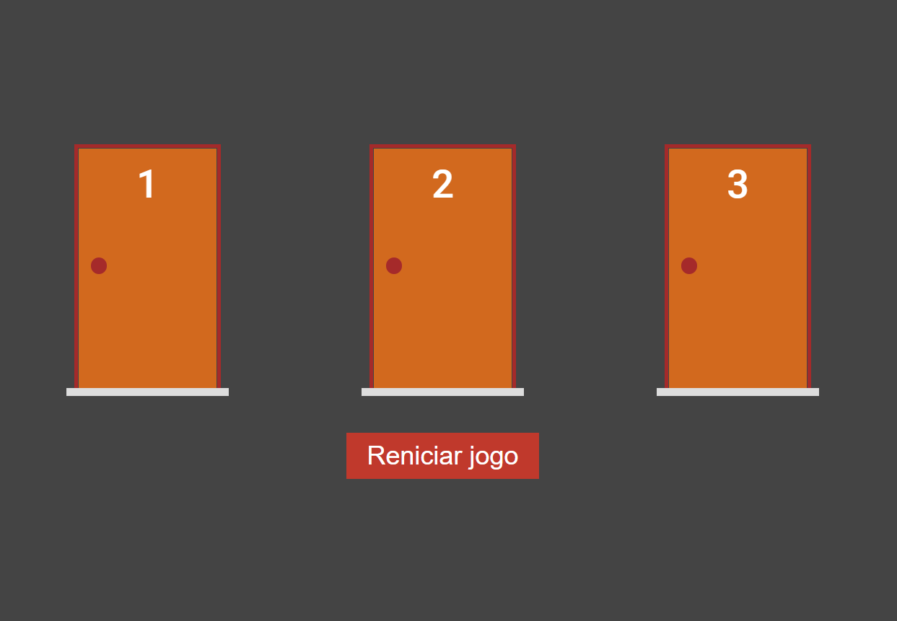

# Porta Premiada

  Objetivo do projeto é, usuário deve escolher umas das portas e advinhar onde presente está.

 

> Proximo nivel 

## 👨‍💻 Tecnologia
 - Nextjs
 - css
 - git e github
 - Typescript

  ## 💛 Contato
 arthursousarabelo2@gmail.com
 